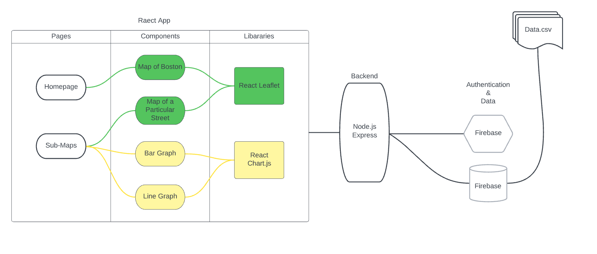
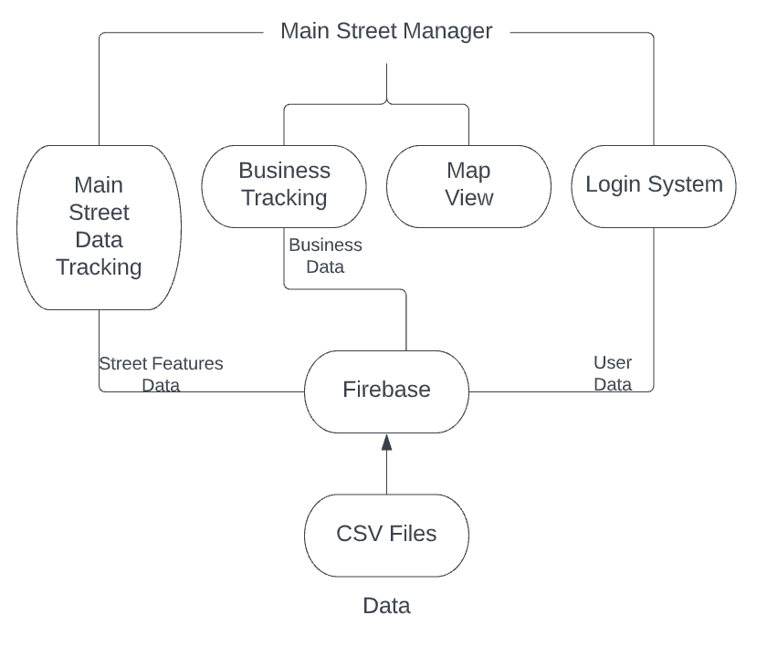

# Boston-Main-Streets

Boston Main Streets District Viewer is a project from the BPDA Research Division and Boston University Spark. This interactive map combines public data and anonymized data from private companies to visualize the characteristics of Boston Main Street Districts and the impact of COVID-19 pandemic on the economic prospects of businesses and people in each district.

This is part of a broader initiative to understand the current environment in Boston. More research produced by the Boston Planning and Development Agency can be found on the BPDA Research Website: www.bostonplans.org/research

Visit the deployed Boston Main Street District Viewer [here]()

Team members:
- Meng-Hsin Cheng
- Austin Wang
- Junan Zhu

## Technical Architecture

Frontend: 
 - React.js

Backend:
 - Node.js

Database:
 - Firebase

Diagram:

 

### Deployment

- set up a heroku account and a firebase account
- copy firebase configuration variables into heroku config var section (each should start with 'REACT_APP_')
- make sure you have installed all tools for the firebase emulator on your local machine
- initialize the database in production: node fire.js remove init
- initialize the database in development: node fire.js mock remove init
- run `deploy:full`

### Running on local machine

Frontend

- setup dotenv file with environment variables using the sampleEnv.txt in the frontend directory

`cd boston-main-streets-frontend`

`npm install && npm start`

Backend

- setup environment variables using the sample file in the backend directory

`cd boston-main-streets-backend`

`npm install && npm start`